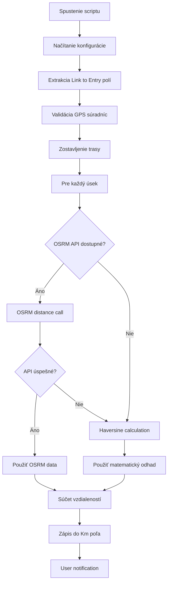
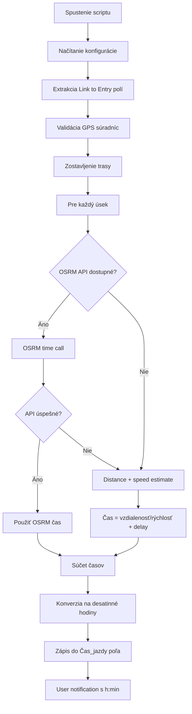

# Memento Database - Route Calculation Workflow
## Kompletná dokumentácia pre vývoj a rozšírenie systému

---

## 📋 Prehľad systému

### **Účel**
Automatizovaný systém pre výpočet vzdialeností a časov jazdy v Memento Database s využitím OpenStreetMap OSRM API pre presné cestné dáta.

### **Kľúčové funkcie**
- ✅ **Výpočet vzdialenosti** - skutočné cestné vzdialenosti cez OSRM API
- ✅ **Výpočet času jazdy** - presné časy jazdy s ohľadom na skutočné cesty
- ✅ **Multi-point routing** - podpora zastávok v trase
- ✅ **Fallback systém** - matematické odhady ak API nefunguje
- ✅ **Debug systém** - komplexný logging a error handling

---

## 🏗️ Architektúra systému

### **Dátový model**

#### **Hlavná knižnica: "Kniha jázd"**
```
Polia:
├── Štart (Link to Entry → Miesta)
├── Zastávky (Link to Entry → Miesta) [Multi-select]
├── Cieľ (Link to Entry → Miesta)
├── Km (Number) - vypočítaná vzdialenosť
├── Čas_jazdy (Number) - vypočítaný čas v hodinách
├── view (Choice: "Editácia", "Debug") - ovládanie debug režimu
├── Debug_Log (Text/Memo) - detailný debug výstup
└── Error_Log (Text/Memo) - error logy
```

#### **Linked knižnica: "Miesta"**
```
Polia:
├── Názov (Text) - názov miesta
├── GPS (Location) - GPS súradnice
└── [ďalšie polia podľa potreby]
```

### **Script architektúra**

#### **Modulárna štruktúra**
```javascript
CONFIG                    // Centralizovaná konfigurácia
├── debug                // Debug režim control
├── osrmServers[]        // OSRM server endpoints
├── timeouts             // HTTP timeouts
└── fallback settings   // Odhady pre fallback

Helper Functions
├── getLinkToEntryField() // Flexible field detection
├── extractGPSFromEntry() // GPS extraction z rôznych formátov
├── writeDebugToField()   // Debug/Error logging
└── errorLog/debugLog()   // Centralizované logging

API Functions
├── getDistanceFromOSRM()     // OSRM distance API
├── getDrivingTimeFromOSRM()  // OSRM time API
└── calculateHaversine()      // Fallback matematik

Main Functions
├── calculateDistance()    // Distance workflow
├── calculateDriveTime()   // Time calculation workflow
└── calculateRoute*()      // Route processing
```

---

## 🔄 Workflow procesy

### **1. Distance Calculation Workflow**



### **2. Time Calculation Workflow**



---

## 🌐 API integrácia

### **OSRM (OpenStreetMap Routing Machine)**

#### **Servery (fallback chain)**
```javascript
osrmServers: [
    "http://router.project-osrm.org/route/v1/driving/",      // Primary
    "https://routing.openstreetmap.de/routed-car/route/v1/driving/", // Backup 1
    "http://osrm.mapzen.com/route/v1/driving/"               // Backup 2
]
```

#### **API call pattern**
```javascript
// URL format: baseUrl + lon1,lat1;lon2,lat2 + params
var url = baseUrl + fromLon + "," + fromLat + ";" + toLon + "," + toLat + 
          "?overview=false&geometries=geojson&steps=false";

// Response parsing
if (data.code === "Ok" && data.routes[0].legs[0]) {
    var distanceKm = data.routes[0].legs[0].distance / 1000;
    var timeHours = data.routes[0].legs[0].duration / 3600;
}
```

#### **Error handling stratégia**
1. **Retry s tým istým serverom** (max 2x) pri 5xx chybách
2. **Switch na ďalší server** pri NoRoute/ServiceUnavailable
3. **Fallback na matematik** ak všetky servery zlyhajú

### **Fallback matematika**

#### **Haversine formula (vzdialenosť)**
```javascript
var R = 6371; // Earth radius in km
var dLat = (lat2 - lat1) * (Math.PI / 180);
var dLon = (lon2 - lon1) * (Math.PI / 180);
var a = Math.sin(dLat/2)² + Math.cos(lat1) * Math.cos(lat2) * Math.sin(dLon/2)²;
var distance = R * 2 * Math.atan2(Math.sqrt(a), Math.sqrt(1-a));
```

#### **Time estimation**
```javascript
var baseTime = distance / averageSpeed;    // 50 km/h default
var cityDelay = 3; // minutes per stop
var totalTime = baseTime + (cityDelay / 60);
```

---

## 🛡️ Error handling systém

### **Multi-level error handling**

#### **1. HTTP level**
```javascript
try {
    var response = httpObj.get(url);
    if (response.code === 200) {
        // Success path
    } else if (response.code >= 500) {
        // Retry logic
    } else {
        // Different error handling
    }
} catch (networkError) {
    // Network error handling
}
```

#### **2. API level**
```javascript
if (data.code === "Ok") {
    // Process successful response
} else if (data.code === "NoRoute") {
    // Try different server
} else {
    // Log error and fallback
}
```

#### **3. Data level**
```javascript
if (lat !== null && lon !== null && !isNaN(lat) && !isNaN(lon)) {
    if (lat >= -90 && lat <= 90 && lon >= -180 && lon <= 180) {
        // Valid GPS coordinates
    }
}
```

### **Logging systém**

#### **Debug logs (conditional)**
```javascript
function debugLog(message) {
    if (CONFIG.debug) {
        var timestamp = new Date().toLocaleTimeString();
        debugMessages.push("[" + timestamp + "] " + message);
    }
}
```

#### **Error logs (always)**
```javascript
function errorLog(message, functionName) {
    var timestamp = new Date().toLocaleTimeString();
    var context = functionName ? "[" + functionName + "] " : "";
    errorMessages.push("[" + timestamp + "] ❌ " + context + message);
}
```

---

## 📊 Debug a monitoring

### **Debug režim aktivácia**
```javascript
var viewMode = entry().field("view") || "Editácia";
var CONFIG = {
    debug: (viewMode === "Debug")
};
```

### **Debug output categories**

#### **GPS extraction logs**
```
--- Spracovávam Štart: KRAJINKA ---
  ✅ Priamy prístup k entry objektu
  🎯 Našiel GPS pole 'GPS': object
    GPS object keys: lat, lon
    Našiel .lat property: 48.721913
    Našiel .lon property: 19.124728
  ✅ GPS úspešne extrahované: 48.721913, 19.124728
```

#### **API call logs**
```
🔗 Používam OSRM server 1/3: http://router.project-osrm.org/...
🗺️ Volám OSRM API pre vzdialenosť...
📍 Súradnice: 48.721913,19.124728 → 48.710130,19.141735
📡 HTTP status: 200
✅ OSRM vzdialenosť: 2.1 km
⏱️ OSRM čas: 3 min
🚀 Priemerná rýchlosť: 42.0 km/h
```

#### **Performance metrics**
```javascript
debugLog("OSRM úspechy: " + osrmSuccessCount + "/" + totalSegments + " úsekov");
```

---

## 🚀 Rozšíriteľnosť

### **1. Pridanie nových API providrov**

#### **Google Maps integration**
```javascript
// Extend CONFIG
googleMapsApiKey: "YOUR_API_KEY",
useGoogleMaps: true,

// Add to server fallback chain
if (osrmTime === null) {
    var googleTime = getDrivingTimeFromGoogleMaps(coords);
    if (googleTime === null) {
        // Fallback to estimate
    }
}
```

#### **MapBox Directions**
```javascript
// Similar pattern
mapboxApiKey: "YOUR_API_KEY",
mapboxUrl: "https://api.mapbox.com/directions/v5/mapbox/driving/"
```

### **2. Rozšírenie kalkulácií**

#### **Fuel consumption calculation**
```javascript
function calculateFuelConsumption(distanceKm, vehicleType) {
    var consumptionPer100km = getVehicleConsumption(vehicleType);
    return (distanceKm / 100) * consumptionPer100km;
}
```

#### **Cost calculation**
```javascript
function calculateTripCost(distanceKm, timeHours) {
    var fuelCost = distanceKm * CONFIG.fuelCostPerKm;
    var timeCost = timeHours * CONFIG.hourlyRate;
    return fuelCost + timeCost;
}
```

### **3. Advanced routing features**

#### **Traffic-aware routing**
```javascript
// OSRM with traffic data
var url = baseUrl + coordinates + 
          "?overview=false&traffic=true&departure_time=" + 
          new Date().getTime();
```

#### **Multi-modal transport**
```javascript
// Different OSRM profiles
var profiles = ["driving", "walking", "cycling"];
var selectedProfile = entry().field("TransportMode") || "driving";
var url = baseUrl.replace("/driving/", "/" + selectedProfile + "/");
```

---

## 📁 Deployment štruktúra

### **Script organization**

```
Memento Database Scripts/
├── Distance Calculator/
│   ├── distance_calculator_osrm.js      // Main distance script
│   ├── distance_config.js               // Configuration constants
│   └── distance_helpers.js              // Helper functions
├── Time Calculator/
│   ├── time_calculator_osrm.js          // Main time script
│   ├── time_config.js                   // Configuration constants
│   └── time_helpers.js                  // Helper functions
├── Shared/
│   ├── gps_extraction.js                // GPS handling utilities
│   ├── osrm_api.js                      // OSRM API wrapper
│   ├── error_handling.js                // Error handling utilities
│   └── debug_logging.js                 // Debug system
└── Tests/
    ├── test_coordinates.js               // Test GPS data
    ├── api_tests.js                      // API connectivity tests
    └── integration_tests.js              // End-to-end tests
```

### **Installation postupnosť**

#### **1. Database setup**
```sql
-- Create Miesta library
CREATE LIBRARY "Miesta" (
    "Názov" TEXT,
    "GPS" LOCATION
);

-- Create Kniha jázd library  
CREATE LIBRARY "Kniha jázd" (
    "Štart" LINK_TO_ENTRY("Miesta"),
    "Zastávky" LINK_TO_ENTRY("Miesta") MULTIPLE,
    "Cieľ" LINK_TO_ENTRY("Miesta"),
    "Km" NUMBER(2),
    "Čas_jazdy" NUMBER(2),
    "view" CHOICE("Editácia", "Debug"),
    "Debug_Log" MEMO,
    "Error_Log" MEMO
);
```

#### **2. Script deployment**
1. Copy distance calculator script → Trigger na "Kniha jázd"
2. Copy time calculator script → Trigger na "Kniha jázd"  
3. Set trigger events: "Creating entry", "Updating entry"
4. Set trigger phase: "Before saving"

#### **3. Testing**
1. Create test locations v "Miesta"
2. Add GPS coordinates
3. Create test route v "Kniha jázd"
4. Set view = "Debug"
5. Save entry a check logs

---

## 🔧 Configuration management

### **Environment-specific configs**

#### **Development**
```javascript
var CONFIG = {
    debug: true,
    osrmTimeout: 30000,        // Longer timeout for debugging
    maxRetries: 3,             // More retries
    averageSpeedKmh: 40,       // Conservative estimate
    useOSRM: true
};
```

#### **Production**
```javascript
var CONFIG = {
    debug: (viewMode === "Debug"),
    osrmTimeout: 15000,        // Standard timeout
    maxRetries: 2,             // Standard retries
    averageSpeedKmh: 50,       // Realistic estimate
    useOSRM: true
};
```

#### **Offline/Testing**
```javascript
var CONFIG = {
    debug: true,
    useOSRM: false,            // Force fallback mode
    averageSpeedKmh: 45,
    maxRetries: 0
};
```

---

## 📈 Performance optimalizácia

### **Caching stratégie**

#### **Entry-level caching**
```javascript
// Cache GPS coordinates per entry
if (!entry()._gpsCache) {
    entry()._gpsCache = extractAllGPSCoordinates();
}
```

#### **Distance matrix caching**
```javascript
// Cache frequent route segments
var cacheKey = fromLat + "," + fromLon + "→" + toLat + "," + toLon;
if (distanceCache[cacheKey]) {
    return distanceCache[cacheKey];
}
```

### **Batch processing**
```javascript
// Process multiple segments v jednom API call
var allCoordinates = coordinates.map(c => c.lon + "," + c.lat).join(";");
var url = baseUrl + allCoordinates + "?overview=false";
```

### **Performance monitoring**
```javascript
var startTime = new Date().getTime();
// ... API call
var endTime = new Date().getTime();
debugLog("API call duration: " + (endTime - startTime) + "ms");
```

---

## 🔒 Security considerations

### **API key management**
```javascript
// Never hardcode API keys
var apiKey = entry().field("APIKey") || CONFIG.defaultApiKey;

// Use environment-specific keys
var apiKey = CONFIG.isProduction ? PROD_API_KEY : DEV_API_KEY;
```

### **Input validation**
```javascript
function validateGPSCoordinates(lat, lon) {
    if (typeof lat !== 'number' || typeof lon !== 'number') return false;
    if (isNaN(lat) || isNaN(lon)) return false;
    if (lat < -90 || lat > 90) return false;
    if (lon < -180 || lon > 180) return false;
    return true;
}
```

### **Rate limiting**
```javascript
var lastApiCall = 0;
var minInterval = 100; // ms between calls

function rateLimitedApiCall() {
    var now = new Date().getTime();
    if (now - lastApiCall < minInterval) {
        // Wait before next call
    }
    lastApiCall = now;
}
```

---

## 📋 Maintenance checklist

### **Týždenné úlohy**
- [ ] Check OSRM server availability
- [ ] Review error logs
- [ ] Monitor API response times
- [ ] Validate calculation accuracy

### **Mesačné úlohy**  
- [ ] Update fallback speed estimates
- [ ] Review debug logs pre patterns
- [ ] Test with edge cases
- [ ] Performance optimization review

### **Kvartálne úlohy**
- [ ] OSRM server endpoint updates
- [ ] Alternative API provider evaluation
- [ ] User feedback integration
- [ ] System architecture review

---

## 🎯 Budúce enhancement príležitosti

### **Short-term (1-3 mesiace)**
- Real-time traffic integration
- Vehicle-specific routing profiles
- Cost calculation module
- Mobile responsiveness improvements

### **Medium-term (3-6 mesiacov)**
- Machine learning pre lepšie odhady
- Historical data analysis
- Batch route optimization
- Advanced reporting dashboard

### **Long-term (6+ mesiacov)**
- Multi-modal transport support
- Carbon footprint calculation
- Integration s fleet management systems
- Predictive routing based on patterns

---

*Dokumentácia vytvorená: December 2024*  
*Verzia: 1.0*  
*Autor: Claude AI Assistant*p